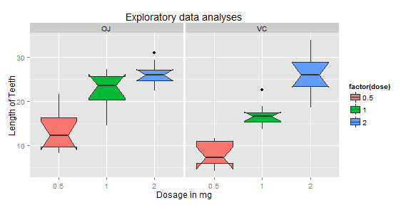

This is a basic statistical inference data analysis. In this report, we're going to analyze the ToothGrowth data in the R datasets package. 


```r
# Setup and run the simulation
setwd('C:\\Users\\Ivan.Liuyanfeng\\Desktop\\Data_Mining_Work_Space\\Data-Science-Statistical-Inference\\project')
library(ggplot2)
library(datasets)
```

---

### Section One
Load the ToothGrowth data and perform some basic exploratory data analyses


```r
data(ToothGrowth)
head(ToothGrowth)
```

```
##    len supp dose
## 1  4.2   VC  0.5
## 2 11.5   VC  0.5
## 3  7.3   VC  0.5
## 4  5.8   VC  0.5
## 5  6.4   VC  0.5
## 6 10.0   VC  0.5
```

```r
g1 <- ggplot(ToothGrowth, aes(x=factor(dose),y=len,fill=factor(dose)))
g1 + geom_boxplot(notch=T) + facet_grid(.~supp) + 
    scale_x_discrete("Dosage in mg") + 
    scale_y_continuous("Length of Teeth") + 
    ggtitle("Exploratory data analyses")
```



The above diagram reveals that longer teeth tend to use higher dosage.

---

### Section Two
Provide a basic summary of the data.


```r
ToothGrowth$dose <- as.factor(ToothGrowth$dose)
summary(ToothGrowth)
```

```
##       len       supp     dose   
##  Min.   : 4.2   OJ:30   0.5:20  
##  1st Qu.:13.1   VC:30   1  :20  
##  Median :19.2           2  :20  
##  Mean   :18.8                   
##  3rd Qu.:25.3                   
##  Max.   :33.9
```

```r
table(ToothGrowth$supp, ToothGrowth$dose)
```

```
##     
##      0.5  1  2
##   OJ  10 10 10
##   VC  10 10 10
```

We can see there are two supplements (OJ and VC) and three kinds of dose (0.5, 1, 2) in this dataset. 

---

### Section Three
Use confidence intervals and hypothesis tests to compare tooth growth by supp and dose. (Use the techniques from class even if there's other approaches worth considering)


```r
supp.t1 <- t.test(len~supp, paired=F, var.equal=T, data=ToothGrowth)
supp.t2 <- t.test(len~supp, paired=F, var.equal=F, data=ToothGrowth)
supp.result <- data.frame("p-value"=c(supp.t1$p.value, supp.t2$p.value),"Conf-Low"=c(supp.t1$conf[1],supp.t2$conf[1]),
                          "Conf-High"=c(supp.t1$conf[2],supp.t2$conf[2]), row.names=c("Equal Var","Unequal Var"))
supp.result
```

```
##             p.value Conf.Low Conf.High
## Equal Var   0.06039   -0.167     7.567
## Unequal Var 0.06063   -0.171     7.571
```

We can see that, in terms of supplements (Orange Juice & Vitamin C), the p values of both equal variance and unequal variance t tests are larger than 5 percent and the confidence intervals of both t tests contain 0. So we cannot deny null hypothesis. So we cannot conclude that there are differences between OJ and VC groups.


```r
dose.05 <- ToothGrowth[which(ToothGrowth$dose==.5),1]
dose.10 <- ToothGrowth[which(ToothGrowth$dose==1),1]
dose.20 <- ToothGrowth[which(ToothGrowth$dose==2),1]
dose0510.t1 <- t.test(dose.05, dose.10, paired=F, var.equal=T)
dose0510.t2 <- t.test(dose.05, dose.10, paired=F, var.equal=F)
dose0510.result <- data.frame("p-value"=c(dose0510.t1$p.value, dose0510.t2$p.value),"Conf-Low"=c(dose0510.t1$conf[1],dose0510.t2$conf[1]),"Conf-High"=c(dose0510.t1$conf[2],dose0510.t2$conf[2]), row.names=c("Equal Var","Unequal Var"), "Dose"="0.5 to 1")
dose0520.t1 <- t.test(dose.05, dose.20, paired=F, var.equal=T)
dose0520.t2 <- t.test(dose.05, dose.20, paired=F, var.equal=F)
dose0520.result <- data.frame("p-value"=c(dose0520.t1$p.value, dose0520.t2$p.value),"Conf-Low"=c(dose0520.t1$conf[1],dose0520.t2$conf[1]),"Conf-High"=c(dose0520.t1$conf[2],dose0520.t2$conf[2]), row.names=c("Equal Var","Unequal Var"), "Dose"="0.5 to 2")
dose1020.t1 <- t.test(dose.10, dose.20, paired=F, var.equal=T)
dose1020.t2 <- t.test(dose.10, dose.20, paired=F, var.equal=F)
dose1020.result <- data.frame("p-value"=c(dose1020.t1$p.value, dose1020.t2$p.value),"Conf-Low"=c(dose1020.t1$conf[1],dose1020.t2$conf[1]),"Conf-High"=c(dose1020.t1$conf[2],dose1020.t2$conf[2]), row.names=c("Equal Var","Unequal Var"), "Dose"="1 to 2")
dose.result <- rbind(dose0510.result,dose0520.result,dose1020.result)
dose.result
```

```
##                p.value Conf.Low Conf.High     Dose
## Equal Var    1.266e-07  -11.984    -6.276 0.5 to 1
## Unequal Var  1.268e-07  -11.984    -6.276 0.5 to 1
## Equal Var1   2.838e-14  -18.154   -12.836 0.5 to 2
## Unequal Var1 4.398e-14  -18.156   -12.834 0.5 to 2
## Equal Var2   1.811e-05   -8.994    -3.736   1 to 2
## Unequal Var2 1.906e-05   -8.996    -3.734   1 to 2
```

From table above, we can see that the dosages do have impact on tooth growth. All of p values are very small and the confidence intervals do not contain zero. So we can deny the null hypthesis and conclude that true difference in means is not equal to 0 among the groups with different dosages. It is clear to see that higher dosage tends to result in higher tooth length.


---

### Section Four
State your conclusions and the assumptions needed for your conclusions. 

To recap, based on the analysis above, we can conclude that across supplements for each dose, 2mg dose has larger impact on tooth growth than 1mg and 0.5mg, and 1mg dose has more impact than 0.5mg dose. While we cannot say that orange juice and vitamin C have obvious different impact on tooth growth.

---

<b>Thank you for reading!</b></br>
<b>Ivan Liu</b></br>
<b>07/09/2014</b></br>
